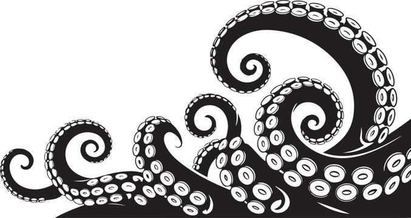

<link
  rel="stylesheet"
  href="https://fonts.googleapis.com/css2?family=JetBrains+Mono:wght@100..800&display=swap"
/>

# ballad 

of argotactical 

  Let's get kraken <carbon:arrow-right />

<!-- bottom-right image -->

<!--
Welcome and thank you for asking about argo tactical… 
-->

---
src: ./slides/argo-origin.md
---

---
src: ./slides/who-we-serve.md
---

---
src: ./slides/confidentiality.md
---

---
src: ./slides/argo-contact.md
---

